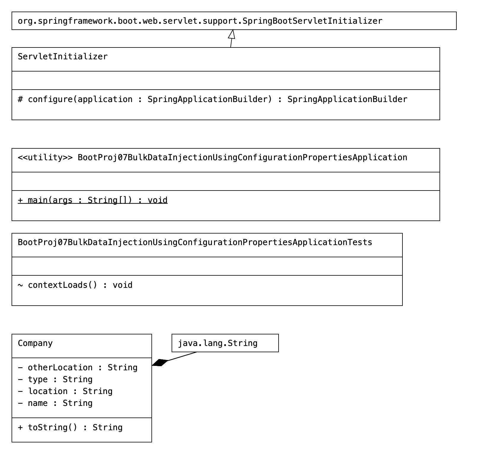

# BootProj07-BulkDataInjectionUsing-ConfigurationProperties

# Code

```Java
package com.core;

import org.springframework.boot.SpringApplication;
import org.springframework.boot.autoconfigure.SpringBootApplication;
import org.springframework.context.ApplicationContext;

import com.core.sbeans.Company;

@SpringBootApplication
public class BootProj07BulkDataInjectionUsingConfigurationPropertiesApplication {

	public static void main(String[] args) {
		ApplicationContext ctx = SpringApplication
				.run(BootProj07BulkDataInjectionUsingConfigurationPropertiesApplication.class, args);

		Company company = ctx.getBean("company", Company.class);
		System.out.println(company);

	}

}
package com.core.sbeans;

import lombok.Getter;
import lombok.Setter;
import org.springframework.beans.factory.annotation.Value;
import org.springframework.boot.context.properties.ConfigurationProperties;
import org.springframework.stereotype.Component;

@Component("company")

@ConfigurationProperties(prefix = "org.nt")
public class Company {

    @Override
    public String toString() {
        return "Company [name=" + name + ", location=" + location + ", type=" + type + ", otherLocation="+ otherLocation+ "]";
    }

    @Setter
    @Getter
    private String name;

    @Setter
    @Getter
    private String location;

    @Setter
    @Getter
    private String type;


    @Value("${org.gt.location}")
    private String otherLocation;

}

```

# Logs

```Java
Company [name=HCL Corp, location=Hyderabad, type=IT Firm, otherLocation=blr]
```

# POM 
```xml
<dependencies>
		<dependency>
			<groupId>org.springframework.boot</groupId>
			<artifactId>spring-boot-starter-web</artifactId>
		</dependency>
		<dependency>
			<groupId>org.projectlombok</groupId>
			<artifactId>lombok</artifactId>
			<optional>true</optional>
		</dependency>
		<dependency>
			<groupId>org.springframework.boot</groupId>
			<artifactId>spring-boot-starter-tomcat</artifactId>
			<scope>provided</scope>
		</dependency>
		<dependency>
			<groupId>org.springframework.boot</groupId>
			<artifactId>spring-boot-starter-test</artifactId>
			<scope>test</scope>
		</dependency>

	</dependencies>
```

# UML

